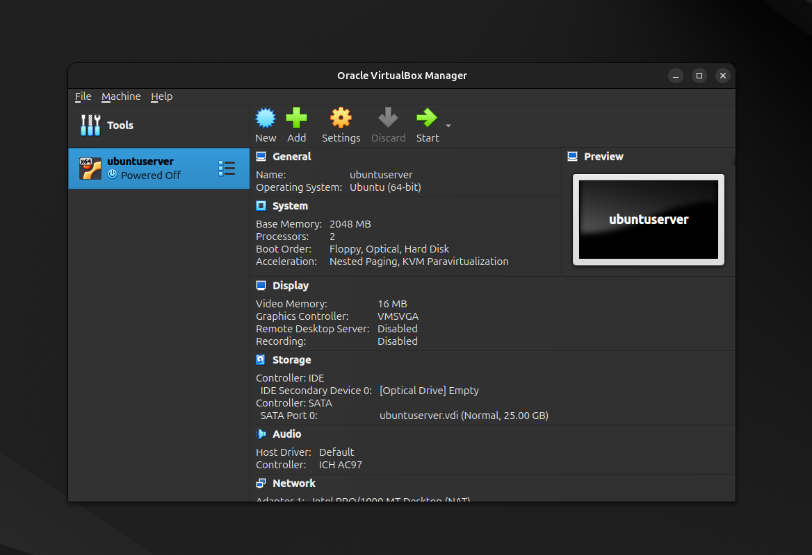

<div align="center">
  <h1>Infraestrutura Web com Monitoramento Automatizado</h1>
</div>
Este projeto implementa uma infraestrutura local simples com Nginx em uma VM Ubuntu Server, servindo uma página HTML e com um sistema de monitoramento que envia alertas via Telegram.

# Passo a passo:
## Etapa 1: Configuração do Ambiente

Nesta etapa, será criada uma máquina virtual com **Ubuntu Server** utilizando o **VirtualBox**. Essa máquina servirá como ambiente de desenvolvimento e testes para toda a infraestrutura do projeto.

> ⚠️ **Observação:** Caso prefira, é possível utilizar o **WSL (Windows Subsystem for Linux)** no Windows, ou qualquer outra distribuição Linux de sua escolha, desde que ofereça suporte ao que está proposto
---

### ✅ 1. Baixar a ISO do Ubuntu Server

Baixe a ISO escolhida do Ubuntu Server no site oficial:

🔗 [https://ubuntu.com/download/server](https://ubuntu.com/download/server)

---

### ✅ 2. Criar a Máquina Virtual no VirtualBox

Abra o **VirtualBox** e clique em **"New"** para criar uma nova VM.

<details>
    <summary><b>Virtual Box</b></summary>
    
</details>

**Configurações sugeridas:**

- **Nome:** ubuntu-server
- **Tipo:** Linux
- **Versão:** Ubuntu (64-bit)
- **Iso Image** escolha a ISO que foi baixada.
- **Memória:** 2048 MB (recomendado)
- **Disco rígido:** Criar um disco virtual agora
- **Tamanho do disco:** 20 GB (dinamicamente alocado)

---

### ✅ 3. Instalar o Ubuntu Server
Inicie a máquina virtual com duplo clique

Durante a instalação:
- Escolha o idioma, região e layout do teclado.
- Use instalação padrão (recomendado).
- Configure um usuário e senha.
- Finalize a instalação.

---

### ✅ 5. Acessar o Ubuntu Server

Após a instalação e reinicialização:
- Faça login com o usuário criado.
- Atualize os pacotes com:

```bash
sudo apt update && sudo apt upgrade -y
