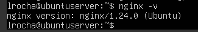
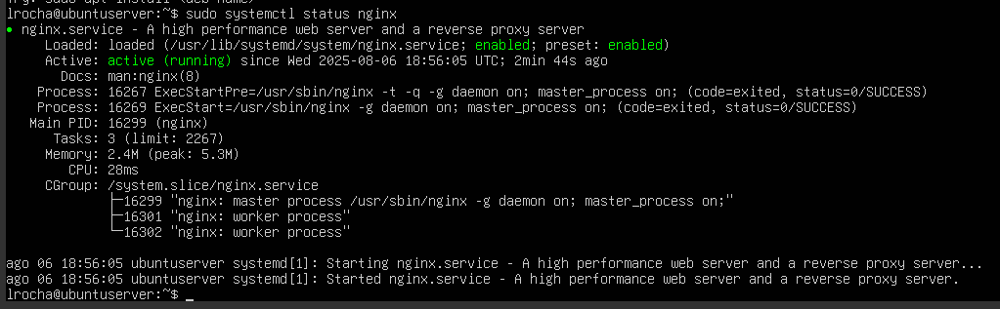
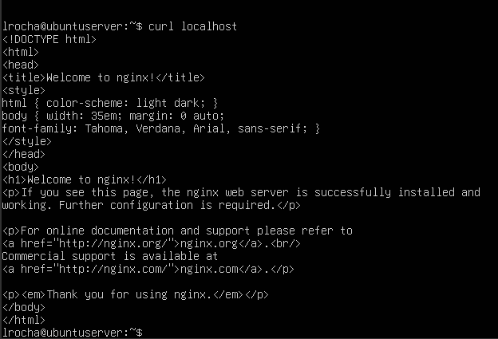
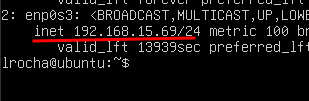
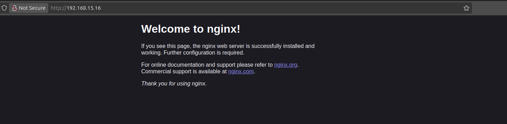
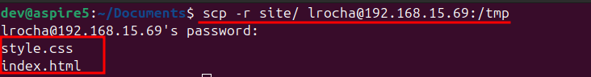
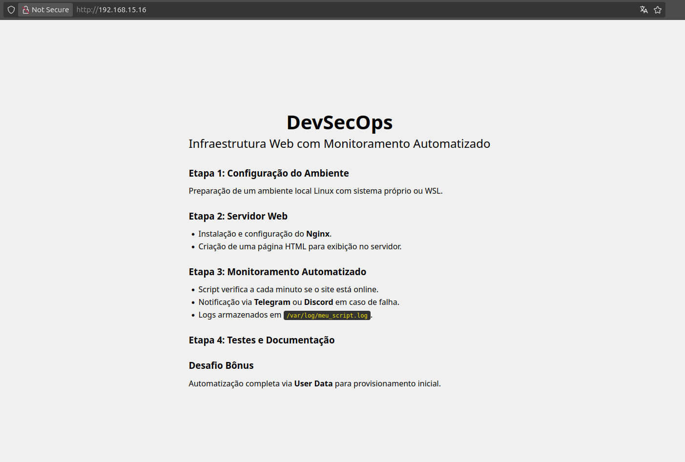

## Etapa 2: Configuração do Servidor Web

Nesta etapa, será instalado e configurado o servidor web **Nginx**, bem como criada uma página HTML que será servida.

---

### ✅ 1. Instalar o servidor Nginx

> [!NOTE]\
> Tanto para o instalar o Nginx como para realizar comandos do sbin, é necessário estar logado como um usuário com permissões de superusuário (grupo `sudo`) ou acessar diretamente como `root`.

```bash
sudo apt update # Atualiza a lista de pacotes
sudo apt install nginx -y # Instala o Nginx sem solicitar confirmação
```

---

#### 1.1 Verificar instalação

Confirme se o Nginx foi instalado corretamente:

```bash
nginx -v
```

<details> <summary><b>Verificação da versão do Nginx</b></summary>  </details>

---
#### 1.2 Verificar status do serviço Nginx

Use o comando abaixo para verificar o status do serviço instalado:

```bash
sudo systemctl status nginx
```

<details> <summary><b>Status do Nginx</b></summary>  </details>

Se estiver inativo, inicie-o com:

```bash
sudo systemctl start nginx
```

---

#### 1.3 Testar o servidor Nginx localmente

Após confirmar que o serviço está ativo, teste se o Nginx está funcionando:

```bash
curl localhost
```

Ou utilizando o IP da VM:

```bash
curl <IP_DA_VM>
```

<details> <summary><b>Testando com curl</b></summary>  </details>

---

#### 1.4 Descobrir o IP da máquina

Para acessar a VM a partir do navegador do seu computador host, descubra o IP da VM com:

```bash
ip -4 a # ...
```
<details> <summary><b>IP privado</b></summary>  </details>

> [!NOTE]\
> A máquina virtual deve estar configurada em modo **Bridge** para estar acessível via IP privado(mesma sub rede).

Agora, abra um navegador na sua máquina e acesse:

```bash
http://<IP_DA_VM>
```

<details> <summary><b>Verificando página do Nginx via browser</b></summary>  </details>

Você deverá ver a página padrão do Nginx, indicando que o servidor está funcionando corretamente.

---

### 1.5 Editando o arquivo de configuração do Nginx (caso necessário)

> ⚠️ **Nota:**  
> Caso você **consiga acessar a página normalmente** via `curl` ou navegador, **pode ignorar esta etapa**.

Abra o arquivo com um editor:

```bash
sudo nano /etc/nginx/sites-available/default
```

Substitua o conteúdo pela configuração abaixo:

```nginx
server {
    listen 80 default_server;
    listen [::]:80 default_server;

    root /var/www/html;

    # Adicione "index.php" caso esteja utilizando PHP
    index index.html;

    location / {
        try_files $uri $uri/ =404;
    }
}
```

#### 1.5.1 Reiniciar o Nginx para aplicar as mudanças

```bash
sudo systemctl restart nginx
```

---

### ✅ 2. Criar uma página HTML personalizada

> 💡 **Dica:**  
> Você pode utilizar como exemplo a pasta **`/site`** disponível neste repositório.

Use o comando `scp` para transferir do host (sua máquina real) para a VM:

```bash
scp -r site/ usuario@IP_DA_VM:/tmp  # Copia a pasta site para o diretório /tmp da VM
```

> 🔄 **Atenção:**  
> Substitua `usuario` e `IP_DA_VM` pelos dados reais da sua máquina virtual.

<details>
  <summary><strong>📸 Exemplo do SCP no terminal</strong></summary>
  
</details>

---

Após a cópia, remova o HTML padrão e mova seus arquivos para o diretório correto:

```bash
cd /etc/nginx
sudo rm -rf /var/www/html/*
sudo mv /tmp/site/* /var/www/html/
```

<details>
  <summary><strong>📸 Movendo e apagando arquivos .html</strong></summary>
  
</details>

---

Depois disso, o Nginx servirá o seu próprio `index.html` em vez do `index.nginx-debian.html`.

<details>
  <summary><strong>🌐 Verificando a página do Nginx via navegador</strong></summary>
  
</details>
```

<div align="center">
  <a href="https://github.com/Lr0cha/WebInfra-AutoMonitoring/blob/main/docs/etapa-1-configuracao-do-ambiente.md">&lt; Voltar</a> |  
  <a href="https://github.com/Lr0cha/WebInfra-AutoMonitoring/blob/main/docs/etapa-3-monitoramento-automatico.md">Próxima Etapa &gt;</a>
</div>
