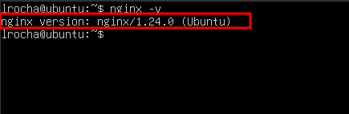
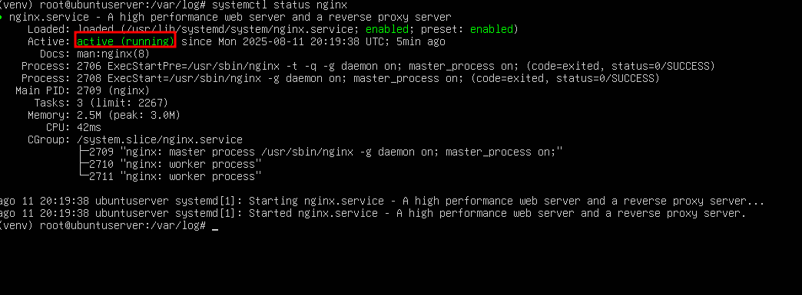

## Etapa 2: Configuração do Servidor Web

Nesta etapa, será instalado e configurado o servidor web **Nginx**, bem como criada uma página HTML que será servida.

---

### ✅ 1. Instalar o servidor Nginx

> [!NOTE]\
> Tanto para o instalar o Nginx como para realizar comandos do sbin, é necessário estar logado como um usuário com permissões de superusuário (grupo `sudo`) ou acessar diretamente como `root`.

```bash
sudo apt update # Atualiza a lista de pacotes
sudo apt install nginx -y # Instala o Nginx sem solicitar confirmação
```

---

#### 1.1 Verificar instalação

Confirme se o Nginx foi instalado corretamente:

```bash
nginx -v
```

<details> <summary><b>Verificação da versão do Nginx</b></summary>  </details>

---
#### 1.2 Verificar status do serviço Nginx

Use o comando abaixo para verificar o status do serviço instalado:

```bash
sudo systemctl status nginx
```

<details> <summary><b>Status do Nginx</b></summary>  </details>

Se estiver inativo, inicie-o com:

```bash
sudo systemctl start nginx
```

---

#### 1.3 Testar o servidor Nginx localmente

Após confirmar que o serviço está ativo, teste se o Nginx está funcionando:

```bash
curl localhost
```

Ou utilizando o IP da VM:

```bash
curl <IP_DA_VM>
```

<details> <summary><b>Testando com curl</b></summary>  </details>

---

#### 1.4 Descobrir o IP da máquina

Para acessar a VM a partir do navegador do seu computador host, descubra o IP da VM com:

```bash
ip -4 a # ...
```
Exemplo de saída:

```bash
2: enp0s3: <...>
    inet 192.168.1.105/24 brd 192.168.1.255 scope global dynamic enp0s3
```
Neste caso o IP é **192.168.1.105**

> [!NOTE]\
> A máquina virtual deve estar configurada em modo bridge para estar acessível via IP privado(mesma sub rede).

Abra um navegador na sua máquina e acesse:

```bash
http://<IP_DA_VM>
```

<details> <summary><b>Verificando página do Nginx via browser</b></summary>  </details>

Você deverá ver a página padrão do Nginx, indicando que o servidor está funcionando corretamente.

---

✅ 2. Criar uma página HTML personalizada


