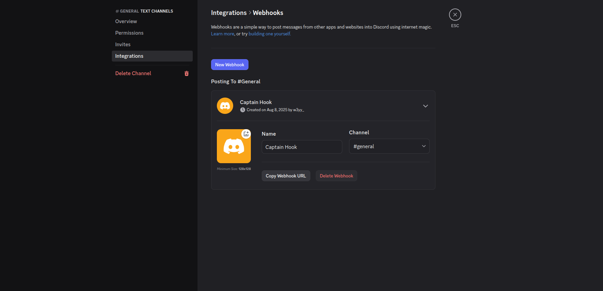
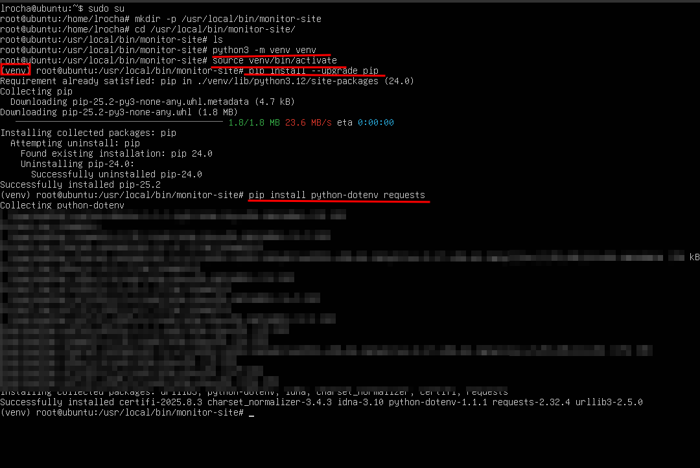
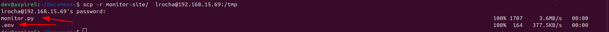
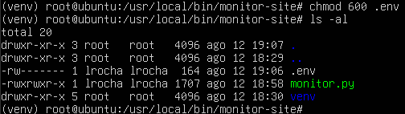
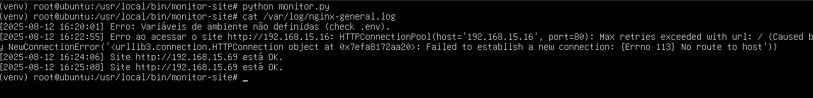
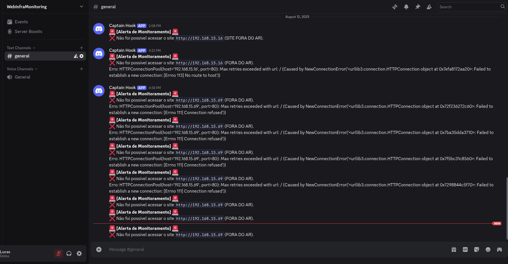

# 🚨 Etapa 3: Monitoramento automático do site com Python e alertas via Discord

Nesta etapa, será criado um script em **Python** que monitorará a disponibilidade do site (HTTP). Se o site estiver fora do ar, um alerta será enviado para um canal do **Discord** via *webhook* e as ocorrências serão registradas em `/var/log/nginx-general.log`. Em seguida vamos agendar a execução com `cron` para rodar **a cada minuto**.

---

## ✅ 1 — Criar um Webhook no Discord

1. Acesse seu servidor no Discord.  
   <details>
   <summary><b>Servidor do Discord</b></summary>
   
   <p><i>Figura — Servidor do Discord</i></p>
   </details>

2. Vá em **Configurações do servidor > Integrações > Webhooks**.  
3. Clique em **"Novo Webhook"**, escolha o canal e **Copiar URL do Webhook**.  
   <details>
   <summary><b>Novo Webhook no Discord</b></summary>
   
   <p><i>Figura — Criando o webhook</i></p>
   </details>
   
> [!NOTE]\
>Guarde a URL do webhook — você usará essa URL no `.env`.

---

## ✅ 2 — Preparar o ambiente e o script

### 2.1 Pré-requisitos (instalar pacotes do sistema)

No terminal da sua VM (Ubuntu):

```bash
sudo apt update
sudo apt install -y python3 python3-venv python3-pip
```
> [!IMPORTANT]\
> `python3-venv` é necessário para criar ambientes virtuais, cada um com seu próprio conjunto independente de pacotes Python instalados em seus diretórios de site.

---

### 2.2 Criar a pasta do projeto e ajustar permissões (usarei como `root`)

```bash
sudo su # para ir como root
mkdir -p /usr/local/bin/monitor-site
cd /usr/local/bin/monitor-site
```

---

### 2.3 Criar e ativar o ambiente virtual (venv)

Dentro da pasta:

```bash
python3 -m venv venv
source venv/bin/activate   # você verá o prompt com (venv), que significa que você está no ambiente virtual python desta pasta
```

Instalar dependências dentro do `venv`:

```bash
pip install --upgrade pip
pip install python-dotenv requests # para usar .env
pip install pytz # gerenciar timezone
```

> [!NOTE]\
> Sempre use o `venv/bin/python` e o `venv/bin/pip` quando referenciar o interpretador do projeto (importante para o `cron`).

<details>
  <summary><b>Terminal do venv</b></summary>
  
  <p><i>Figura — Ambiente virtual </i></p>
</details>

---

### 2.4 Criar o arquivo `.env`

Crie `.env` dentro da pasta `/monitor-site`:

```bash
nano /usr/local/bin/monitor-site/.env
```

Exemplo de conteúdo (substitua pelos seus valores):

```
SITE_URL=http://192.168.15.69
WEBHOOK_URL=https://discord.com/api/webhooks/SEU_WEBHOOK_AQUI
```

> [!NOTE]\
> Interessante retirar algumas permissões do `.env`:
>
>```bash
>chmod 600 /usr/local/bin/monitor-site/.env
>```

---

### 2.5 Exemplo de script para fazer o monitoramento (em `Python`):

A seguir, uma visão geral do funcionamento do script que está na pasta `/scripts`:

### 1️⃣ Importação de bibliotecas

```python
import os
import requests
import datetime
import pytz
from dotenv import load_dotenv
import subprocess
```

Essas bibliotecas são usadas para:
- **os** → ler variáveis de ambiente  
- **requests** → fazer requisições HTTP  
- **datetime** e **pytz** → lidar com data/hora e fuso horário  
- **dotenv** → carregar variáveis do arquivo `.env`  
- **subprocess** → executar comandos no sistema (ex.: reiniciar serviços)

---

### 2️⃣ Carregando variáveis de ambiente

```python
load_dotenv(dotenv_path="/usr/local/bin/monitor-site/.env")

URL = os.getenv("SITE_URL")
WEBHOOK_URL = os.getenv("WEBHOOK_URL")
LOG_PATH = "/var/log/nginx-general.log"
```

- **`load_dotenv`** → carrega as variáveis do arquivo `.env`  
- `SITE_URL` → endereço do site monitorado  
- `WEBHOOK_URL` → link do webhook do Discord  
- `LOG_PATH` → caminho do arquivo de log

---

### 3️⃣ Função para enviar alerta ao Discord

```python
def send_discord_alert(message):
    payload = {"content": f"🚨 **[Alerta de Monitoramento]** 🚨\n{message}"}
    try:
        response = requests.post(WEBHOOK_URL, json=payload)
        response.raise_for_status()
    except requests.exceptions.RequestException as e:
        log(f"Erro ao enviar alerta para o Discord: {e}")
```

Envia uma mensagem formatada para o Discord.  
Caso ocorra erro, registra no log.

---

### 4️⃣ Função para reiniciar o serviço Nginx

```python
def restart_service():
    subprocess.run(["systemctl", "restart", "nginx"], check=True)
    send_discord_alert(f"🔄 Serviço nginx do {URL} reiniciado automaticamente com sucesso no servidor!")
```

Reinicia o **nginx** usando `systemctl` e envia um alerta informando que o serviço foi reiniciado.

---

### 5️⃣ Função para registrar logs

```python
def log(message):
    timezone = pytz.timezone('America/Sao_Paulo')
    now = datetime.datetime.now(timezone).strftime("%Y-%m-%d %H:%M:%S")
    with open(LOG_PATH, "a") as f:
        f.write(f"[{now}] {message}\n")
```

Registra mensagens no log com a hora de Brasília.

---

### 6️⃣ Função principal para verificar o site

```python
def check_site():
    if not URL or not WEBHOOK_URL:
        log("Erro: Variáveis de ambiente não definidas (check .env).")
        return

    try:
        response = requests.get(URL, timeout=10)
        if response.status_code == 200:
            log(f"Site {URL} está OK.")
        else:
            log(f"Site {URL} retornou o status code: {response.status_code}")
    except requests.exceptions.RequestException as e:
        log(f"Erro ao acessar o site {URL}: {e}")
        send_discord_alert(f"❌ Não foi possível acessar o site `{URL}` (FORA DO AR).\n")
        restart_service()
```

Passos dessa função:
1. Verifica se as variáveis estão definidas.
2. Faz requisição ao site.
3. Se o site estiver OK, registra no log.
4. Se estiver fora do ar, registra, envia alerta e reinicia o **nginx**.

---

### 7️⃣ Execução do script

```python
if __name__ == "__main__":
    check_site()
```

Garante que a função `check_site()` seja executada quando o script for rodado diretamente.

---

### 2.6 Copiar / colar o `monitor.py` para a VM

Se você editou o script localmente na sua máquina ou pegou o script que deixei na pasta `/scripts`:

Copie para a VM:

```bash
scp pasta/ usuario@IP_DA_VM:/tmp
```

<details>
  <summary><b>Exemplo SCP no terminal</b></summary>
  
  <p><i>Figura — Copiando arquivo para a VM</i></p>
</details>

Mover o script para o diretório do projeto na VM:

```bash
mv /tmp/monitor_site.py /usr/local/bin/monitor-site/monitor.py
```

Edite o script com `nano` se precisar:

```bash
nano /usr/local/bin/monitor-site/monitor_site.py
```

Torne executável:

```bash
chmod +x /usr/local/bin/monitor-site/monitor.py
```

### As permissões devem ficar dessa maneira:

<details>
  <summary><b>Permissões pasta de monitoramento</b></summary>
  
  <p><i>Figura — ls da pasta de monitoramento</i></p>
</details>

---

### 2.7 Criar o arquivo de log e ajustar permissões

```bash
cd /var/log
touch nginx-general.log
chmod 664 /var/log/nginx-general.log
```

---

### 2.8 Teste manual (dentro do venv)

Ative o venv e execute o script manualmente:

```bash
cd /usr/local/bin/monitor-site
source venv/bin/activate
python monitor.py

```

> [!IMPORTANT]\
> Para desativar o ambiente virtual use `deactivate`

Verifique o log:

```bash
cat /var/log/nginx-general.log
```

<details>
  <summary><b>Teste manual da venv</b></summary>
  
  <p><i>Figura — Exemplo de teste manual com venv</i></p>
</details>

Se o site estiver caído, você verá entradas no log e receberá a notificação no Discord.

<details>
  <summary><b>Notificação de erro no Discord</b></summary>
  
  <p><i>Figura — Exemplo de mensagem de alerta no Discord</i></p>
</details>

---

## ✅ 3 — Agendar execução automática com `cron`

1. Abra o crontab:

```bash
crontab -e
```

2. Adicione a linha abaixo para executar **a cada minuto** usando o Python do `venv`:

```bash
* * * * * /usr/local/bin/monitor-site/venv/bin/python /usr/local/bin/monitor-site/monitor.py >> /var/log/nginx-general.log 2>&1
```

**Explicação rápida:**
- `* * * * *` → executa a cada 1 minuto.
- Usa `/usr/local/bin/monitor-site/venv/bin/python` para garantir as bibliotecas instaladas no `venv`.
- Redireciona saída padrão e erros para o mesmo arquivo de log.

<details>
  <summary><b>Configuração do cron</b></summary>
  
  <p><i>Figura — Cron configurado para rodar o script a cada minuto</i></p>
</details>

3. Salve e saia do editor (`Ctrl+O`, `Enter`, `Ctrl+X` no nano; `:wq` ou `:x` no vi).
