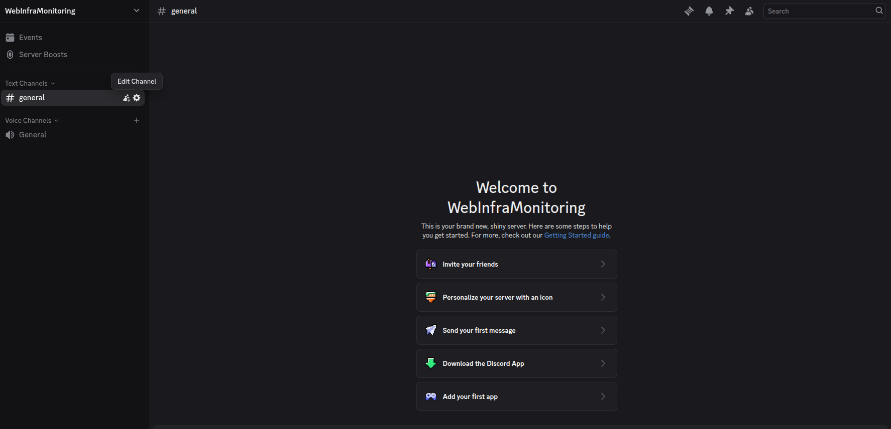

# 🚨 Etapa 3: Monitoramento automático do site com Python e alertas via Discord

Nesta etapa, será criado um script em `Python` que monitora o site via `response` a disponibilidade. Se estiver fora do ar, um alerta será enviado via Discord, e logs serão salvos em `/var/log/nginx-general.log` além do uso de `crontab` para monitoramento constante a cada minuto.

---

## ✅ 1 Criar um Webhook no Discord

1. Acesse seu servidor do Discord.

 
<b>Servidor do discord</b>
  

2. Vá em **Configurações do servidor > Integrações > Webhooks**.
3. Clique em **"Novo Webhook"**.
4. Selecione o canal.

 
<b>Novo WebHook no discord</b>
  

5. Clique em **Copiar URL do Webhook** – você usará isso mais adiante.

